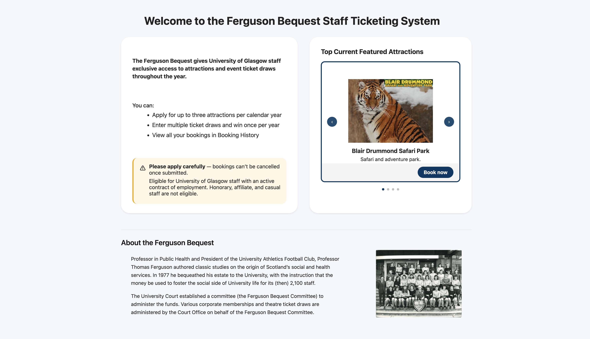
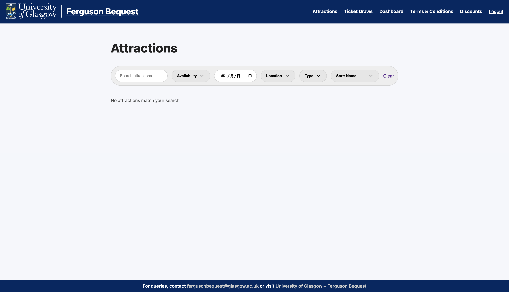
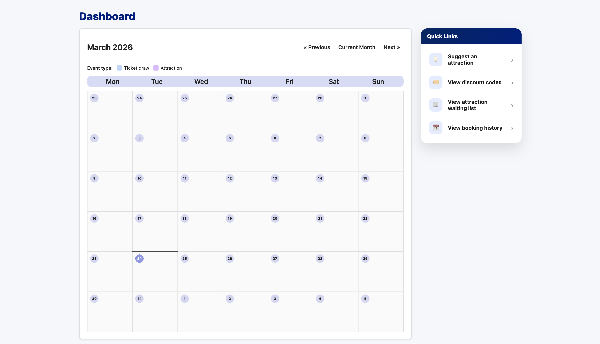
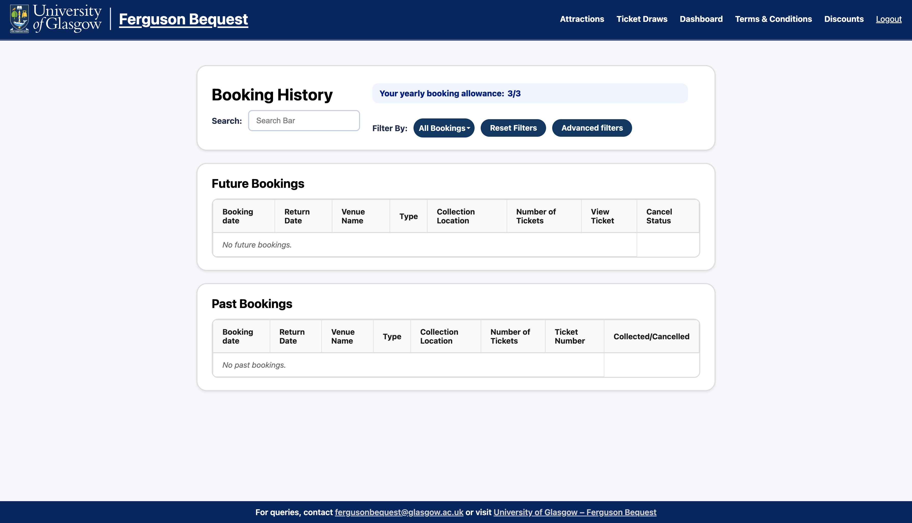
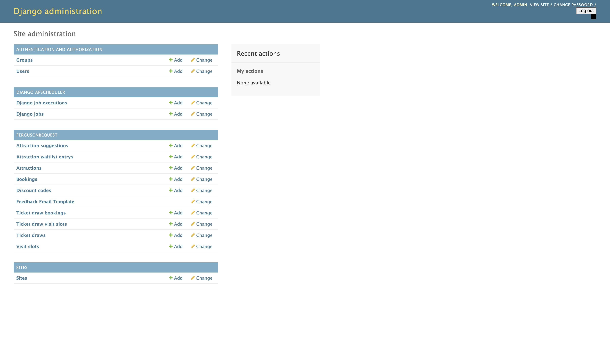
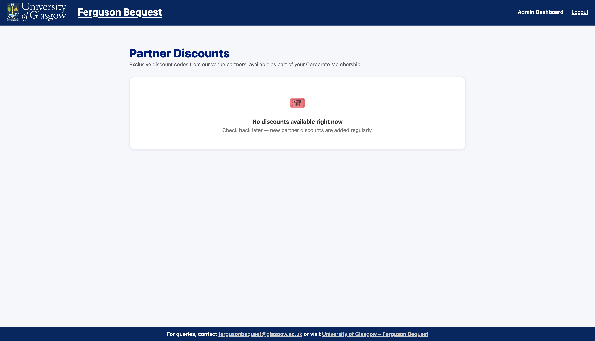

# 🎟️ Ferguson Bequest – Staff Ticketing System

A Django-based web application providing University of Glasgow staff with exclusive access to attractions, bookings, and ticket draws.

---

## 🌐 Overview

This system allows eligible staff members to:

* Browse attractions and events
* Book visits
* Enter ticket draws
* Join waiting lists
* Manage bookings and cancellations
* Access partner discount codes

Administrators can manage the system via the admin interface.

---

## 🖼️ System Preview

### 🏠 Home Page


### 🎡 Attractions


### 👤 User Dashboard


### 📜 Booking History


### ⚙️ Admin Dashboard


### 💸 Discount Codes


---

## ⚙️ Core Features

### 👥 User
* Authentication (login/register)
* Browse and book attractions
* Ticket draw participation
* Waiting list system
* Booking history & cancellation
* Email notifications
* Discount code access

### 🛠️ Admin
* Manage attractions & slots
* Run ticket draws
* Upload tickets
* Manage discount codes
* Handle user suggestions
* Export reports

---

## 📏 Business Rules

* Maximum **3 bookings per year**
* Users can enter multiple draws but **win only once**
* Winners must respond within **72 hours**
* Tickets may be sent after the relevant cancellation deadline
* Only eligible staff can participate

---

## 🏗️ System Architecture

```text
User → Django Views → Models → Database
                         ↓
                  Scheduler (APS)
                         ↓
                  Email System
```

---

## 🔄 System Flow

### Booking Flow
1. Select attraction
2. Check eligibility
3. Verify slot
4. Create booking
5. Send confirmation

### Ticket Draw Flow
1. Enter draw
2. Execute draw
3. Select winner
4. Notify user
5. Re-draw if needed

---

## 🧰 Tech Stack

| Layer     | Technology                                              |
| --------- | ------------------------------------------------------- |
| Backend   | Django 5.2.8                                            |
| Language  | Python 3.11                                             |
| Database  | SQLite                                                  |
| Scheduler | django-apscheduler                                      |
| Email     | Django email backend (console by default, SES optional) |
| Export    | openpyxl                                                |
| Images    | Pillow                                                  |

---

## 📁 Project Structure

```text
sh22-main/
├── config/
├── fergusonbequest/
├── templates/
├── static/
├── docs/
├── manage.py
├── requirements.txt
└── .env.example
```

---

## 🚀 Quick Start

```bash
git clone https://stgit.dcs.gla.ac.uk/team-project-h/2025/sh22/sh22-main.git
cd sh22-main

python3 -m venv venv
source venv/bin/activate

pip install -r requirements.txt

cp .env.example .env

python manage.py migrate
python manage.py createsuperuser
python manage.py collectstatic
python manage.py runserver
```

Open:
http://127.0.0.1:8000/

---

## Environment Configuration

Create a `.env` file using `.env.example`.

At minimum, `DJANGO_SECRET_KEY` must be set.

For local development, you may wish to use:
- `DJANGO_DEBUG=True`
- `EMAIL_BACKEND=django.core.mail.backends.console.EmailBackend`

---

## 🧪 Testing

```bash
python manage.py test fergusonbequest
```

---

## 👨‍💻 Team Contributions

This project was developed collaboratively across:
* backend logic and data modelling
* frontend UI and styling
* testing and debugging
* documentation
* feature development for bookings, draws, admin tools, and communications

---

## ⚠️ Known Limitations

* SQLite is currently used as the default database and is better suited to development
* Automated scheduler-based processes are currently tied to the Django development server setup
* Email sending requires external configuration when not using the default development backend
* Mobile responsiveness and some admin workflows could be improved further

---

## 🔮 Potential Enhancements

* Improved analytics dashboard
* Better UI consistency
* More production-ready Docker/container deployment
* Enhanced access control
* Migration to a more scalable database such as PostgreSQL

---

## 📦 Deployment Note

This project is currently prepared primarily for local or internal deployment and demonstration use.

Production deployment would require additional work around database choice, background task handling, and service configuration.

---

## 📬 Contact

Contact **fergusonbequest@glasgow.ac.uk** or visit **University of Glasgow – Ferguson Bequest**

---

## 📄 License

This project is licensed under the MIT License – see the [LICENSE](LICENSE) file for details.  
Copyright (c) 2025 Group SH22, University of Glasgow